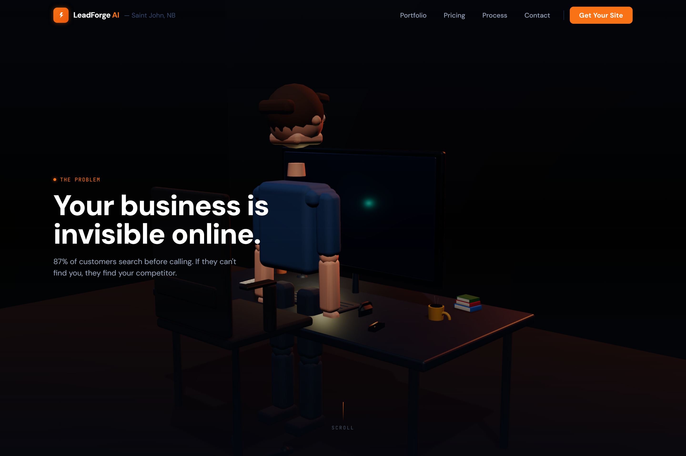

# LeadForge AI

> Autonomous outbound lead generation, powered by Claude.

A Claude AI agent runs every weekday morning at 6:00 AM — finding businesses without websites, sending personalised cold outreach, handling replies, generating mockups, and routing warm leads to Neil Mitchell — who delivers a professional React/Next.js site in 3–5 days for a flat $650.

## Website Preview



---

## Repository Structure

```
leadforge/
├── agent/                  # Python agent — runs daily via GitHub Actions
│   ├── agent.py            # Main orchestrator (15-min runtime cap)
│   ├── config.py           # Environment variables & constants
│   ├── lead_discovery.py   # Google Maps → businesses without websites
│   ├── email_sender.py     # Resend cold outreach
│   ├── lead_db.py          # SQLite lead database
│   ├── reply_handler.py    # Gmail reply reading + Claude classification
│   ├── mockup_generator.py # Claude HTML mockup generation
│   ├── follow_up.py        # Day 3 / Day 7 follow-up sequences
│   ├── requirements.txt
│   └── .env.example
│
├── website/                # Next.js 14 website — leadforge-ai.ca
│   ├── app/
│   │   ├── page.tsx        # Home
│   │   ├── portfolio/      # Portfolio
│   │   ├── pricing/        # Pricing
│   │   ├── process/        # How It Works
│   │   └── contact/        # Contact form
│   ├── components/
│   │   ├── Navbar.tsx
│   │   ├── Footer.tsx
│   │   ├── PricingCard.tsx
│   │   └── ProcessStep.tsx
│   └── ...
│
└── .github/
    └── workflows/
        └── agent.yml       # GitHub Actions cron (Mon–Fri 6 AM)
```

---

## Quick Start

### 1. Website

```bash
cd website
npm install
npm run dev          # → http://localhost:3000
npm run build        # Production build
```

Deploy to Vercel:
```bash
npx vercel           # Follow prompts
```

### 2. Agent — Local Development

```bash
cd agent
python -m venv .venv
source .venv/bin/activate    # Windows: .venv\Scripts\activate
pip install -r requirements.txt
cp .env.example .env         # Fill in your API keys
python agent.py
```

### 3. GitHub Actions (Production)

Add these as **repository secrets** (Settings → Secrets → Actions):

| Secret | Where to get it |
|--------|----------------|
| `ANTHROPIC_API_KEY` | console.anthropic.com |
| `RESEND_API_KEY` | resend.com |
| `GOOGLE_MAPS_API_KEY` | Google Cloud Console → Places API |
| `SENDER_EMAIL` | neil@leadforge-ai.ca |
| `GMAIL_TOKEN_JSON` | Generated by Gmail OAuth flow |

The workflow fires Mon–Fri at 9:00 UTC (≈6:00 AM ADT).  
Manual trigger available via the **Actions** tab → **Run workflow**.

---

## Gmail OAuth Setup (for reply handling)

1. Go to [Google Cloud Console](https://console.cloud.google.com/)
2. Enable the **Gmail API**
3. Create OAuth 2.0 credentials → Desktop App
4. Download `credentials.json` → place in `agent/`
5. Run once locally to generate `token.json`:
   ```bash
   python -c "from reply_handler import check_and_handle_replies; check_and_handle_replies()"
   ```
6. Copy the contents of `token.json` → GitHub Secret `GMAIL_TOKEN_JSON`

---

## Financial Model

| Scenario | Revenue | Net Profit | Margin |
|----------|---------|-----------|--------|
| 1 site/month | $650 | ~$438 | 67% |
| 3 sites/month ★ | $1,950 | ~$1,738 | 89% |
| 6 sites/month | $3,900 | ~$3,638 | 93% |

**Fixed overhead:** $201.50/month (Claude Max 20x: $200 + domain: $1.50)  
**Break-even:** 0.31 sites/month

---

## Tech Stack

| Layer | Technology |
|-------|-----------|
| AI agent | Claude Sonnet (Anthropic) |
| Lead discovery | Google Maps Places API |
| Email outbound | Resend (free tier) |
| Lead database | SQLite (no hosting cost) |
| Website | Next.js 14 + Tailwind CSS |
| Deployment | Vercel (free tier) |
| Scheduler | GitHub Actions (free tier) |

---

## Contact

**Neil Mitchell** — President & CEO · CTO  
LeadForge AI · Saint John, NB  
📞 506-639-9083  
🌐 neil-mitchell.vercel.app
